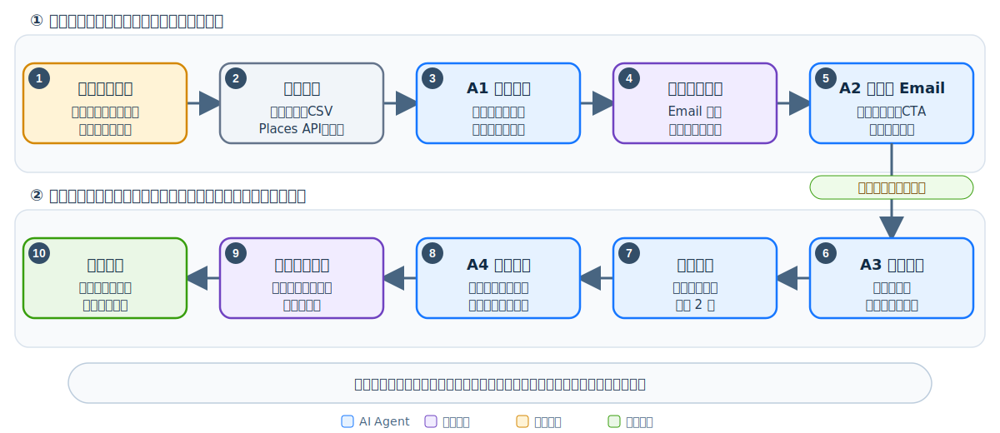

# 承炘國際貿易有限公司：AI 客戶開發 Agent 規格書

版本：v1.0｜日期：2026-07-15｜定位：以 Email 自動開發海外客戶

## 先看懂這幾個詞

| 文件用詞 | 白話意思 |
|---|---|
| 目標客戶條件（ICP） | 我們最想開發哪一類公司，例如國家、產業、公司規模、需求及聯絡人職位 |
| 開發活動（Campaign） | 針對一群目標客戶執行的一次寄信計畫 |
| 客戶管理系統（CRM） | 保存客戶、聯絡紀錄、商機與負責業務的系統 |
| 小規模試做（PoC） | 先用少量名單驗證系統真的能用，再決定是否全面上線 |
| 系統介面（API） | 讓寄信系統、客戶管理系統與 Agent 自動交換資料的管道 |
| 詢價（RFQ） | 客戶要求報價或提供正式詢價資料 |

以下正文以中文為主；英文縮寫只在技術串接需要時保留。

## 1. Agent 目標

本 Agent 的主要任務是自動完成海外客戶開發：建立潛客名單、判斷適配度、驗證 Email、產生個人化開發信、排程寄送、自動跟進、辨識回覆意向，並在客戶表達正向興趣時交由業務接手。

設計原則為「**自動處理正常案件，只讓人工處理例外與商機**」。正式運作後不需逐封審核；人工只負責：

1. 初次設定目標客戶條件、產品資訊、寄送政策與允許市場。
2. 處理低信心、資料衝突或合規例外。
3. 接手有興趣、詢價或要求樣品的客戶。

詢價文件分析、供應商比價、企業內部管理系統（ERP）與報關不列入本階段，未來可另行擴充。

## 2. 成功指標

| 指標 | 小規模試做目標 |
|---|---:|
| 合格潛客研究與建檔時間 | 降低 70% 以上 |
| 通過規則的信件自動寄送比例 | ≥90% |
| Email、姓名、公司與產品敘述的錯誤寄送 | 0 |
| 拒絕、退訂、退信後仍繼續寄送 | 0 |
| 正向回覆分流召回率 | ≥95% |
| 業務只需處理的比例 | 全部名單的 10–20% 以下 |

正式成效指標應包含：送達率、退信率、回覆率、正向回覆率、會議／詢價數、每個商機成本及人工接手時間。

## 3. 自動化工作流程

### 自動與人工分界

| 情況 | 系統動作 | 是否人工 |
|---|---|---|
| 名單符合目標客戶條件、Email 已驗證、內容通過政策 | 自動排程寄送 | 否 |
| 未回覆且未達跟進上限 | 依策略自動跟進 | 否 |
| 明確拒絕、退訂或硬退信 | 停止寄送並加入抑制名單 | 否 |
| 一般詢問，可由核准知識回答 | 產生回覆草稿或依政策自動回覆 | 通常否 |
| 正向回覆、詢價、樣品或會議需求 | 建立客戶管理系統商機並通知業務 | 是，業務接手 |
| 資料衝突、低信心或涉及未核准承諾 | 暫停並進入例外佇列 | 是，只處理例外 |

## 4. Agent 模組

### A1 潛客研究 Agent

目前沒有既有潛客名單，因此 A1 必須先負責「主動找公司」，不能只接受匯入資料。

**必要輸入**：承炘要銷售的產品、產品中英文關鍵字、海關商品編碼（HS Code，如有）、目標國家、客戶類型、公司規模、希望聯絡的職位及排除條件。缺少產品與市場資料時可以建立系統，但不能準確找名單。

**自動處理**：

- 從合法資料來源主動建立公司清單，再從公司官網取得產品與聯絡證據。
- 以網域、公司名稱與地址去重，避免重複開發既有客戶。
- 依目標客戶條件計算 0–100 分；低於門檻的名單不進入寄送流程。
- 保存來源、抓取日期、適配理由與資料信心。

**輸出**：公司、網域、國家、產業、應用、聯絡人、職稱、Email、來源、目標客戶符合分數、適配理由、資料信心。

#### 名單從哪裡來

| 優先 | 來源 | 用途 | 取得方式 |
|---:|---|---|---|
| 1 | 貿易與進出口資料 | 依產品關鍵字或 HS Code 找實際進口商、買家及競品客戶 | 優先採有授權的匯出或系統介面；可評估 [Panjiva](https://panjiva.com/)；[ImportYeti](https://www.importyeti.com/faqs) 先採人工研究／CSV，不直接爬網站 |
| 2 | B2B 公司資料庫 | 依國家、產業與產品補足公司母體 | 採購合法名單或匯出資料；可評估 [Kompass](https://us.kompass.com/buy-company-list/)、[Europages](https://www.europages.fr/en)、北美工業市場的 [Thomasnet](https://www.thomasnet.com/) |
| 3 | 地區商家搜尋 | 找特定地區的進口商、經銷商、製造商或品牌商 | 使用 [Google Places API](https://developers.google.com/maps/documentation/places/web-service/place-details) 取得公司名稱、地址與官網，不爬 Google Maps 畫面 |
| 4 | 展會與公協會名錄 | 找與產品直接相關的參展商、會員及通路商 | 僅使用允許商業使用、下載或自動讀取的公開名錄；否則人工匯入 |
| 5 | 公司官方網站 | 確認產品、應用、地區、公司類型與公開聯絡方式 | 只讀公開頁面，遵守網站規則；優先讀首頁、產品、關於我們、聯絡我們及團隊頁 |
| 6 | 聯絡人與 Email 服務 | 找採購、供應鏈、產品或業務開發職位並驗證 Email | 可評估 [Hunter Discover、Domain Search、Email Finder 與 Verifier](https://help.hunter.io/en/articles/1970956-hunter-api) 或同類合約服務 |

#### 怎麼蒐集

1. 先用產品關鍵字、HS Code、競爭品牌及目標國家產生候選公司。
2. 找到公司法定名稱、官網與來源證據，先去重，不急著找個人 Email。
3. 只讀公司官網公開頁面，判斷是否真的銷售、使用、進口或經銷相關產品。
4. 達到目標客戶分數後，再找採購、供應鏈、產品或業務開發聯絡人，避免浪費查詢費。
5. Email 通過第三方驗證且不在禁止聯絡名單，才可進入寄信流程。
6. 每筆資料必須保留「從哪裡找到、哪一頁證明、何時取得、是否允許使用」。

**不得自動爬取**：LinkedIn、需要登入或付費牆的頁面、禁止機器讀取的網站、CAPTCHA 後內容，以及 Google Maps 搜尋畫面。LinkedIn 官方禁止第三方爬蟲與自動化工具；若需要其資料，只能使用官方允許的產品或人工操作。[LinkedIn 說明](https://www.linkedin.com/help/linkedin/answer/a1341387)

### A2 Email 個人化 Agent

**輸入**：合格潛客、核准產品能力、目標語言、品牌語氣、活動模板與歷史互動。

**自動處理**：

- 產生主旨與 120–180 字的個人化開發信。
- 說明聯絡原因、適配產品與一個明確下一步，例如回信或預約會議。
- 根據語言與市場調整語氣，但保留公司名、姓名、料號與數字。
- 只能引用已核准的產品、認證與案例；不得猜測價格、庫存、最低訂購量、交期或材料性能。

### A3 寄送與跟進 Agent

寄送前執行確定性檢查：

1. Email 格式與驗證結果合格。
2. 收件人不在退訂、拒絕、退信或內部封鎖名單。
3. 公司、姓名、語言與信件內容一致。
4. 沒有重複寄送、禁止詞、未核准承諾或未知欄位。
5. 未超過活動、信箱、網域與市場的寄送限制。

全部通過後自動寄送。未回覆者依活動策略自動跟進，預設最多 2 次；收到任何停止訊號即取消所有後續任務。

### A4 回覆分流 Agent

回覆分類：

- **有興趣**：要求報價、樣品或會議。
- **一般問題**：詢問產品或合作方式。
- **目前不需要**：可依公司政策延後聯絡。
- **拒絕**：明確表示無意願。
- **要求停止聯絡**：永久加入禁止聯絡名單。
- **系統通知**：退信、休假或自動回覆。
- **無法判斷**：信心不足，交由人工處理。

「有興趣」會自動建立商機、附上公司摘要與對話紀錄並通知負責業務；「拒絕」、「要求停止聯絡」與無法送達的硬退信會自動停止活動，不需人工判斷。

## 5. 核心資料

| 資料物件 | 必要欄位 |
|---|---|
| 開發活動 | 目標客戶條件、國家、語言、模板、寄送窗口、跟進次數、停止條件、負責人 |
| 潛在客戶 | 公司、網域、國家、產業、聯絡人、職稱、Email、來源、符合分數、資料信心 |
| 信件 | 收件人、主旨、內容、語言、模板版本、個人化依據、寄送狀態 |
| 回覆 | 原始郵件、分類、信心、摘要、建議動作、對應潛在客戶 |
| 禁止聯絡名單 | Email／網域、原因、來源、加入時間、是否永久 |
| 商機 | 公司、聯絡人、正向訊號、對話摘要、客戶管理系統編號、負責業務 |

## 6. 技術架構

- **客戶開發工作台**：設定活動、查看進度、正向商機與例外。
- **Agent 流程控制器**：依固定流程呼叫 A1–A4，不允許模型自行擴大權限。
- **規則引擎**：負責 Email、抑制名單、頻率、數字、禁止詞與寄送門檻。
- **郵件串接模組**：建立、寄送及監控郵件；接收新信與退信通知。
- **客戶管理系統串接模組**：讀取既有客戶，寫入潛客、活動與正向商機。
- **資料庫與稽核**：保存活動、名單、訊息、回覆、決策理由與執行結果。

初期預算有限時，可將上述元件縮成一套本機程式，運行在承炘現有電腦或自購 16 GB RAM／512 GB SSD 小型電腦；以 CSV／Excel 或簡易本機頁面操作，不先做完整工作台與 CRM 串接。新信採每 5–10 分鐘主動檢查，不需要公開 webhook 或強制租用雲端。未來再依成果逐項加入 CRM、多人工作台、多信箱與雲端部署。

若使用 Microsoft 365，可透過 Microsoft Graph 建立／寄送郵件並訂閱新郵件事件；寄送需 `Mail.Send` 權限。[郵件自動化](https://learn.microsoft.com/en-us/graph/outlook-create-send-messages)、[sendMail](https://learn.microsoft.com/en-us/graph/api/user-sendmail?view=graph-rest-1.0)、[變更通知](https://learn.microsoft.com/en-us/graph/api/subscription-post-subscriptions?view=graph-rest-1.0)

## 7. 技術可行性評估

**整體判定：有條件可行。** 郵件寄送、收件通知、AI 固定格式輸出與客戶管理系統回寫都有成熟的系統介面；但名單品質、Email 可送達性、寄件網域信譽及企業權限必須以小規模試做實測，不能由 AI 保證。

| 能力 | 可行性 | 實作方式 | 小規模試做必驗證 |
|---|---|---|---|
| 從零蒐集公司名單 | 中高 | 貿易資料＋公司資料庫＋Places API＋允許讀取的官網 | 產品詞、HS Code、來源授權、官網配對及 300 筆候選公司抽查 |
| 客戶名單匯入與去重 | 高 | 從資料來源、客戶管理系統或試算表匯入；依公司網域、Email 與客戶編號去重 | 實際系統權限與欄位對應 |
| 潛客研究與目標客戶評分 | 中高 | 合法資料來源＋規則評分＋AI 摘要 | 100 筆資料的正確性、來源授權與缺漏率 |
| Email 驗證 | 中高 | 第三方驗證服務＋禁止聯絡名單 | 全收型信箱與誤判率；不可只靠格式檢查 |
| 個人化信件生成 | 高 | 核准知識庫＋固定輸出格式＋規則檢查 | 20 封中公司、姓名、產品事實錯誤為 0 |
| 自動寄送與跟進 | 高 | Microsoft 365 或 Gmail 串接＋排程佇列 | 管理員同意、寄送限制、防重複寄送與退信 |
| 新回覆監控 | 高 | 郵件系統的新信通知 | 通知續期、延遲／漏事件補抓與對話關聯 |
| 回覆分類與停止 | 高 | AI 分類＋規則優先；低信心才人工 | 正向召回率 ≥95%；拒絕／退訂 100% 停止 |
| 商機寫回客戶管理系統 | 高 | 透過系統介面寫入；以事件編號防止重複建立 | 在測試環境驗證建立、更新、重試與權限 |
| 到達率與回覆率 | 不可保證 | 完成寄件網域驗證、逐步增加寄送量並控管名單與內容品質 | 以小量真實寄送觀察；未達門檻即降速或暫停 |

技術前提：取得郵件與客戶管理系統的串接權限、完成寄件網域驗證、確認合法名單來源、選定 Email 驗證服務，並允許新信通知或排程服務運行。AI 模型須能輸出固定格式，再由規則引擎決定是否寄信。[OpenAI 模型能力](https://developers.openai.com/api/docs/models/gpt-5-mini)、[Gmail 寄信](https://developers.google.com/workspace/gmail/api/guides/sending)、[Gmail 新信通知](https://developers.google.com/workspace/gmail/api/guides/push)

## 8. 自動寄送控制

為減少逐封人工審核，改採「活動一次核准＋規則自動放行」：

1. 小規模試做的前 20 封採人工檢查，用於校正模板與規則。
2. 通過驗收後，活動只需主管核准一次。
3. 符合目標客戶條件、Email 驗證、資料信心與內容政策者自動寄送。
4. 只有低信心、資料矛盾、未核准宣稱或異常回覆才進人工佇列。
5. 系統需有活動暫停、信箱暫停與全域緊急停止開關。

## 9. 驗收測試

| 測試 | 通過標準 |
|---|---|
| 既有客戶去重 | 已知重複帳戶找出比例 ≥95%，不得自動錯誤合併 |
| Email 驗證 | 未驗證、無效或高風險地址不得寄送 |
| 個人化正確性 | 公司、姓名、語言、產品事實錯誤為 0 |
| 自動放行 | 合格測試名單 ≥90% 無需人工即可寄送 |
| 停止條件 | 拒絕、退訂、硬退信後 100% 取消後續寄送 |
| 回覆分類 | 整體正確率 ≥90%，正向回覆召回率 ≥95% |
| 權限 | Agent 無法繞過規則、抑制名單或活動限制 |
| 防重複 | 系統重試時不會重複寄送同一封信 |

## 10. 導入順序

| 階段 | 交付內容 | 上線條件 |
|---|---|---|
| 0. 盤點 | 目標客戶條件、產品知識、郵件／客戶管理系統、寄送政策、目前成效 | 資料與負責人確認 |
| 1. 小規模試做 | 100 筆名單、20 封人工檢查、回覆分類測試 | 錯誤寄送為 0 |
| 2. 小規模自動化 | 單一市場、單一信箱、活動一次核准 | 自動放行與停止條件達標 |
| 3. 正式運作 | 多活動、多語、商機交接、成效儀表板 | 監控、告警與緊急停止完成 |

## 11. 啟動前確認

1. 使用哪個郵件系統與客戶管理系統？
2. 第一個產品的中英文名稱、關鍵字、HS Code、目標國家、客戶類型與職稱是什麼？
3. 哪些產品、認證、案例與商業說法可對外使用？
4. 活動寄送上限、跟進次數、停止條件與負責業務為何？
5. 哪些市場或聯絡人不得自動寄送？
6. 是否可取得郵件與客戶管理系統的管理員同意、寄件網域設定權限及新信通知端點？

上述項目設定完成後，Agent 即可由「逐封人工審核」切換為「規則自動寄送、人工只處理例外與正向商機」。
