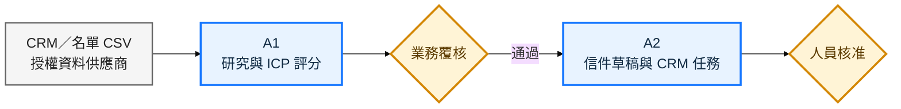

# 目標工作流程 1／3：前段業務開發

[← 返回規格書](../承析國際_AI_Agent規格書.md) ｜ [下一頁：郵件承接與 RFQ →](02_郵件承接與RFQ.md)

本頁結果：只有通過 ICP 與人工覆核的潛客，才能形成待核准的開發信；Agent 無權自行寄送。

[← 返回規格書](../承析國際_AI_Agent規格書.md) ｜ [下一頁：郵件承接與 RFQ →](02_郵件承接與RFQ.md)
