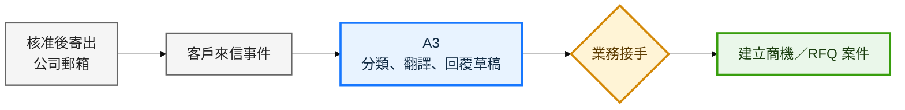

# 目標工作流程 2／3：郵件承接與 RFQ

[← 上一頁：前段業務開發](01_前段業務開發.md) ｜ [下一頁：文件與 ERP →](03_文件與ERP.md)

本頁結果：Agent 將回覆分流並準備雙語草稿；業務確認有商機後才建立 RFQ 案件並進入文件流程。

[← 上一頁：前段業務開發](01_前段業務開發.md) ｜ [下一頁：文件與 ERP →](03_文件與ERP.md)
