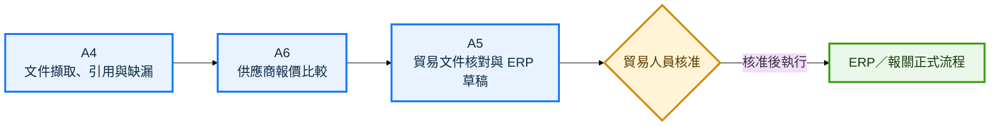

# 目標工作流程 3／3：文件、比價與 ERP

[← 上一頁：郵件承接與 RFQ](02_郵件承接與RFQ.md) ｜ [返回規格書 →](../承析國際_AI_Agent規格書.md)

本頁結果：AI 只整理、比對並建立 ERP 草稿；正式 ERP 寫入與報關仍由有權限的人員核准執行。

[← 上一頁：郵件承接與 RFQ](02_郵件承接與RFQ.md) ｜ [返回規格書 →](../承析國際_AI_Agent規格書.md)
